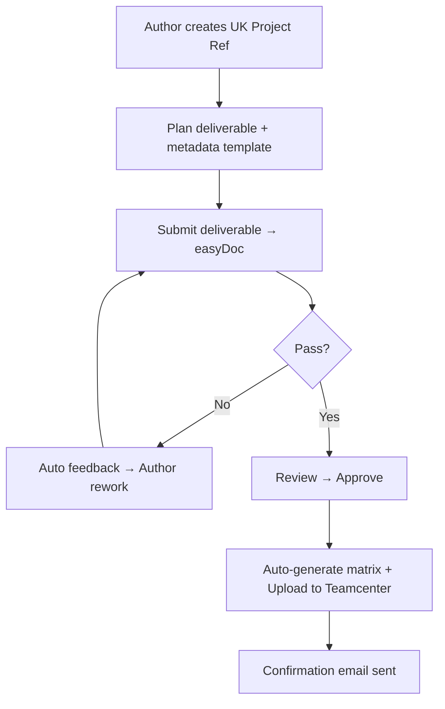

```mermaid
flowchart TD
    A[Author creates UK Project Ref]
    B[Plan deliverable + metadata template]
    C[Submit deliverable → easyDoc]
    D{Pass?}
    E[Auto feedback → Author rework]
    F[Review → Approve]
    G[Auto-generate matrix + Upload to Teamcenter]
    H[Confirmation email sent]

    A --> B
    B --> C
    C --> D
    D -- No --> E
    E --> C
    D -- Yes --> F
    F --> G
    G --> H
```
# DRAW
